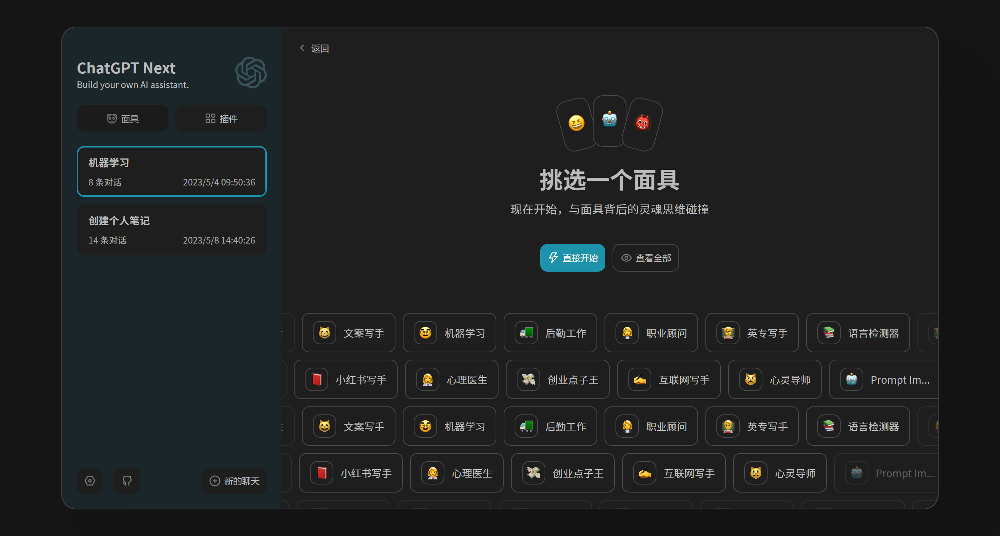
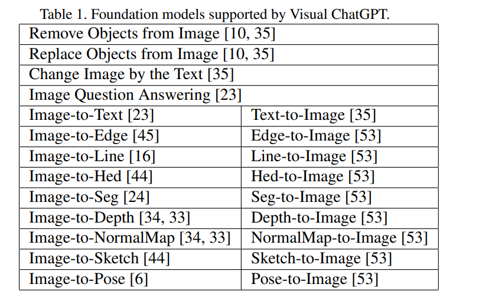
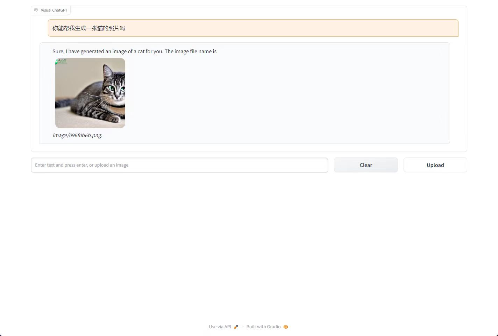
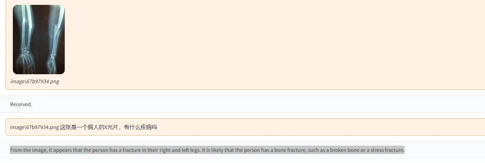
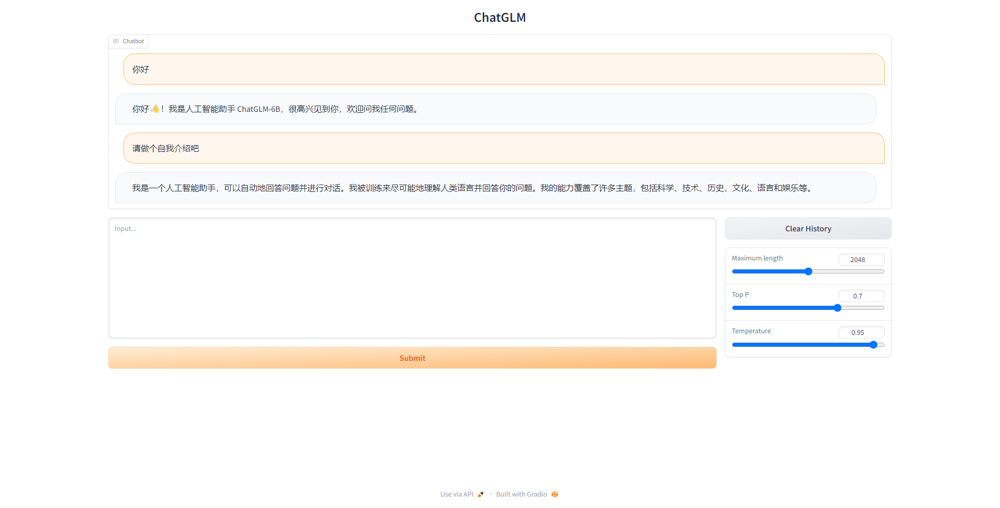
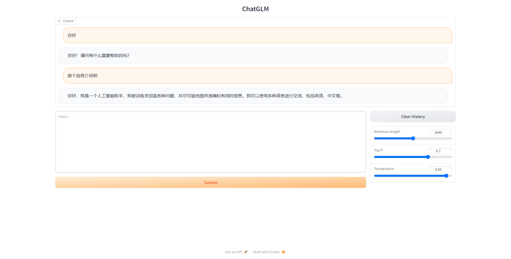

# LLM Study-Notes⏰

   🌐 <a href="https://github.com/FabinGL" target="_blank">Github</a> • 📃  <a href="https://fabingl.github.io/" target="_blank">HomePage</a>  

在这个笔记中我会分享一些我个人学习ChatGPT以及LLM大语言模型的过程经历，同时也会记录一些代码上的坑。实际上最近不止玩了LLM还玩了图像的模型，但是现在这个已经很成熟了，所以等以后有空研究研究再写吧。
本人以下操作基于以下电脑配置完成💻。
- CPU:5900X
- GPU:3080Ti O12G
- 内存:32G
- Windows 11

实在穷啊，别人都是拿几张A100玩，我就只能拿自己的个人电脑玩一下了😭。

## Introdation
大语言模型（英文：Large Language Model，缩写LLM），也称大型语言模型，是一种人工智能模型，旨在理解和生成人类语言。它们在大量的文本数据上进行训练，可以执行广泛的任务，包括文本总结、翻译、情感分析等等。LLM的特点是规模庞大，包含数十亿的参数，帮助它们学习语言数据中的复杂模式。这些模型通常基于深度学习架构，如转化器，这有助于它们在各种NLP任务上取得令人印象深刻的表现。

目前我使用的大语言模型分别有以下两种，分别是GPT3.5与国内清华与智谱华章所发行的ChatGLM模型，接下来我会对这两个模型进行系统性的说明与比较。

## GPT3.5
目前对于GPT3.5所配置的API已经可以玩出很多花来了。一般在直接在OPENAI的网站上使用是免费的。如果你要使用接下来的模型就要去OPENAI拿账户的API，我是同学帮我拿的，由于我经常被OPENAI墙😥。**使用OPENAI的API的，LLM模型都是在云端计算的，不需要自身电脑的算力。**

### GPT3.5的配置
这个没有什么困难的，只需要照着OPENAI官网的来就好了，一般就是给个KEY然后GIT一下仓库，jupyter notebook里就可以直接调用了。但是主要就是要钱。效果就可以不用多说了，目前最强的。基本问题他都能解决，这个一般人也都够用了。

#### GPT构建个人网站和小程序API接口
这个点名表扬一下胡同学找到的好东西，找到了这么一个好玩意给我们用。拿出GPT的API以后可以[制作小程序](https://github.com/waylaidwanderer/node-chatgpt-api)以及[构建个人GPT网站](https://github.com/Yidadaa/ChatGPT-Next-Web)。具体教程可以在Google上搜一搜。都是教程。基本就是Fork一下然后稍微配置一下就可以使用了。目前我是配置了我自己的个人ChatGPT的网站，挺好用的。稀土掘金的教程里还说可以配置自己的域名然后就不用挂梯子了。我比较懒就没去配置。但是足够使用了。不配置域名的话也只要挂梯子就可以使用了。这里的梯子的节点就不一定要在美国了，使用官网的GPT服务需要节点挂在美国然后经常被墙，自己的GPT网站不指定挂哪里的梯子，只要挂了梯子都能用，目前还没崩溃过的情况。非要说BUG的话，我之前有一次在别的电脑使用发现他输出在前端网页展示不完整，不过这个应该是前端的问题。目前也就出现过一次，大致是可以忽略的。

可以看到他懂的非常多，由于我最近在进行一些大气学科以及机器学习交叉的工作，所以我也经常问他问题，大气学科的专业名词它也能够答上来，真的很厉害了，强推同学们构建一个自己的网站。

在和ChatGPT聊天之前可以先指定他的运用场景，他可以充当小红书写手，练习雅思的工具等等。非常好用。

### Visual ChatGPT
这个更是个重量级产品，实际上就是GPT4了，在图像领域真的和造神一样。你可以叫他分割图像，也可以叫他生成图，叫他理解图片，不过这个非常吃显存。点这里可以转跳到他的[Guithub项目](https://github.com/microsoft/TaskMatrix)。

可以看到它可以根据你的要求生成图片，提取出线稿等等，最近Diffusion又出来一个模型叫做ControlNet,具体配置可以看[B站的教程](https://www.bilibili.com/video/BV1fa4y1G71W/?spm_id_from=333.999.0.0&vd_source=628628960a416b6de42d5c7fdc17a7fc)（这个模型也很有趣，以后有时间做图像方面的笔记再细聊吧）。Visual ChatGPT在图像方面实现的功能很大程度和ControlNet重叠，不过Visual ChatGPT可以实现图生文的功能。还是那句话：术业有专攻嘛，大家想要真的生成好的图像还是去试试已经完善的扩散生成模型。Visual ChatGPT所能实现的具体所有功能如下图所示:

Visual ChatGPT配置的话就是分为以下几步:
- Windows电脑需要先下载Git工具，Linux电脑则不用了
- 在你想要安装的地址运行win+R输入CMD打开命令行
- 运行`git clone https://github.com/microsoft/visual-chatgpt.git`，这里要挂梯子。
- 创建新环境，当然这里可以用自己已经有的环境。`conda create -n visgpt python=3.8`
- 激活环境`conda activate visgpt`
- 安装依赖`pip install -r requirements.txt`
- 这里有两个指令分别针对Linux和Windows的，这里的Your_Private_Openai_Key要替换成自己的:
  - windows运行`set OPENAI_API_KEY={Your_Private_Openai_Key}`
  - Linux运行`export OPENAI_API_KEY={Your_Private_Openai_Key}`
- 接着就可以在命令行打开`python visual_chatgpt.py --load "ImageCaptioning_cuda:0,Text2Image_cuda:0"`
这里的模型(Imagecaptioning,Text2Image)是可以组合着来的，也可以指定部署在不同的显卡上(Cuda:n)，其中ChatGPT是利用云端计算返回的结果，所以不占用电脑算力，但是生成图像的过程是在本地电脑上生成的。所以电脑还是需要提供生成图像所要的算力。在我的电脑上启动上述两个模型大概使用了7.5G的显存。**需要注意的是ImageCaptioning这个模块是一定要加载的，不然会报错**(要生成图像首先要了解图像嘛)。**还有一个一定一定要注意的点,所有的图像生成模型下载下来大概在200G上下,大家一定要注意下自己的硬盘容量是否足够！！**

具体算力要求如下:
| Foundation Model        | GPU Memory (MB) |
|------------------------|-----------------|
| ImageEditing           | 3981            |
| InstructPix2Pix        | 2827            |
| Text2Image             | 3385            |
| ImageCaptioning        | 1209            |
| Image2Canny            | 0               |
| CannyText2Image        | 3531            |
| Image2Line             | 0               |
| LineText2Image         | 3529            |
| Image2Hed              | 0               |
| HedText2Image          | 3529            |
| Image2Scribble         | 0               |
| ScribbleText2Image     | 3531            |
| Image2Pose             | 0               |
| PoseText2Image         | 3529            |
| Image2Seg              | 919             |
| SegText2Image          | 3529            |
| Image2Depth            | 0               |
| DepthText2Image        | 3531            |
| Image2Normal           | 0               |
| NormalText2Image       | 3529            |
| VisualQuestionAnswering| 1495            |

所以要运行所有的模型大概需要40G的显存，我玩不起，希望以后可以玩一下吧TAT。

 
上面这张图就是Visual ChatGPT基本的流程结构图，可以看到他就是以ChatGPT作为一个“大脑”来控制其他的“眼睛”（图像模型）的。我上面也提到过，只不过大脑在云端，眼睛是在自己电脑上，所以需要显存运行。

目前我自己也部署好了这个模型，尝试了一下效果，其实效果并不是很好，比如我给他的指令是“画一个亚洲女人”，但是他有时会画出脸崩坏的女人。猫狗的效果都还可以。但是真人图画出来不太好看（相比于专业的扩散模型）。这很明显是本地图像模型生成的问题，不是模型的理解有误（ChatGPT部署在云端，并且我给的关键词很简单）。但实际上我尝试了一下，在专门的扩散生成的模型里输入同样的提示词效果也差不多。所以的话我觉得这是Chatgpt理解后生成的提示词不是很对，在扩散生成模型里面有一个专门的反推提示词的模型叫做`Tagger`，就是我们输入一张图像，他就能生成这个图像的提示词。我觉得未来真要改进的话，这个是一个方向。也就是
**输入->ChatGLM+Tagger耦合->输入扩散生成模型->生成图像->输出**这种结构，我觉得可以实现。（不过我也是个小菜鸡，这只是我的一个拙见）。

下面就是一些我运行的结果图，我测试了他文生图和看图说话的能力。
- 文生图的能力
   - 让Visual ChatGPT给我画一只猫。
   
   - 让Visual ChatGPT给我画一个我们Lab的Logo
   
   - 让Visual ChatGPT帮我生成一个亚洲女人的形象，呃怎么说呢，其实不算崩坏，只是不符合现在的审美，感觉有点像十年前的照片？
   

- 图生文的能力
   - 让Visual ChatGPT判断图像里有什么？（感谢吴同学假期出游提供的素材哈哈哈）
   
   - 让Visual ChatGPT判断疾病，这张图是湿疹的图片，GPT回答的大差不差。
   
   - 让Visual ChatGPT判断X光片，图里的病人的X光片骨折了。GPT完美回答。
   

然后看以上生成的图片我发现一个问题，就是说目前他有一点小BUG，就比如说我在上文中提到了我想要和你说中文，但是说着说着他又会用英文和你交流，还有就是实际上这玩意好像暂时无法在图片里生成中文，参考我帮实验室生成的Logo，里面像是一些乱码或是罗马文之类的？

目前关于ChatGPT我大概做到的就是这些，后面会继续研究补充一些东西。ps：最近沙特的MiniChatGPT4非常的火，但是我的师兄说效果不行我没有配置，还有一个AutoGPT，那个也是个神一般的模型在我看来，你给一个任务，然后他会有两个GPT打架来互相纠错帮你完成这个任务，这真的很神奇，颇有一种找人给你打工的感觉，但是听说要收费，而且我也看到一些博客里面写到AutoGPT难以收敛（找不到最终的解决办法），我本人电脑算力也不足所以还没尝试，这里记录一下等以后AutoGPT版本稳定了可以做尝试。

## ChatGLM
自从ChatGLM出来以后，清华和智谱AI联手搞了一个模型叫做ChatGLM,ChatGLM目前又有两个版本，一个是[ChatGLM-6b](https://github.com/THUDM/ChatGLM-6B)，一个是[ChatGLM-130b](https://github.com/THUDM/GLM-130B)。ChatGLM-130b不是普通人家能玩起的。显存要求极高。
| **Hardware**    | **GPU Memory** | **Quantization** | **Weight Offload** |
| --------------- | -------------- | ---------------- | ------------------ |
| 8 * A100        | 40 GB          | No               | No                 |
| 8 * V100        | 32 GB          | No               | Yes (BMInf)        |
| 8 * V100        | 32 GB          | INT8             | No                 |
| 8 * RTX 3090    | 24 GB          | INT8             | No                 |
| 4 * RTX 3090    | 24 GB          | INT4             | No                 |
| 8 * RTX 2080 Ti | 11 GB          | INT4             | No                 |

你看看人家这拿来训练的显卡。我暂时就玩不起了，ChatGLM-130b一共有130亿参数，ChatGLM-6b面向普通群众的，参数量是62亿。也可以进行微调，这个后面会详细讲。我目前主要的探索都是基于ChatGLM-6b的模型的。**接下来的所有使用到的ChatGLM模型都是ChatGLM-6b**。
而ChatGLM又分为三个子版本：
- FP16无量化版本
- INT8量化版本
- INT4量化版本

ChatGLM-6b各个版本的显存要求如下所示：
| **量化等级**   | **最低 GPU 显存**（推理） | **最低 GPU 显存**（高效参数微调） |
| -------------- | ------------------------- | --------------------------------- |
| FP16（无量化） | 13 GB                     | 14 GB                             |
| INT8           | 8 GB                     | 9 GB                             |
| INT4           | 6 GB                      | 7 GB                              |

我的电脑目前是安装了INT8与INT4两个版本,FP16最低要求13G显存，所以我玩不了，运行的话就会有如下报错：
`OutOfMemoryError: CUDA out of memory`

ChatGLM的布置流程如下：
- 同样下载GIT，上文已经提到，这里不再过多赘述。
- `git clone https://huggingface.co/THUDM/chatglm-6b`
- 从Hugging face上下载模型，下载之后放在本地文件夹。
   - [ChatGLM-FP16](https://huggingface.co/THUDM/chatglm-6b)
   - [ChatGLM-INT8](https://huggingface.co/THUDM/chatglm-6b-int8)
   - [CHATGLM-INT4](https://huggingface.co/THUDM/chatglm-6b-int4)
- `cd ChatGLM-6B`
- 将文件中的`web_demo.py`文件和`cli_dem.py`文件中的模型参数改成本地模型，假设说上一步中的模型我下载在`D:\ChatGLM-INT8`,那么这里就是将模型中的`THUDM/ChatGLM-6B`替换为`D:\ChatGLM_INT8`。
- `conda activate {your_env_name}`启动虚拟环境
- `python web_demo.py` or `python cli_demo.py`

ChatGLM-6b INT8版本和INT4版本的效果差别感觉不是很大，我感觉INT8版本会更带有人类的感情一些。

这是INT8量化的ChatGLM-6b：

这是INT4量化的ChatGLM-6b：

具体的大家配置好可以自己去尝试一下，我觉得这暂时是中文里面做的最好的了。实际上市面上还有一个竞品，[复旦的MOSS](https://github.com/OpenLMLab/MOSS)（流浪地球里的MOSS现实版），这个我没有配置，但是我的师兄配置在Lab了，据我所知效果不是很好，而且我电脑吃不太动，所以我没配置。感兴趣的同学可以点上面的链接自己配置一下玩。

MOSS的配置显存要求：
| 量化等级 | 加载模型 | 完成一轮对话（估计值） | 达到最大对话长度2048 |
| -------- | -------- | ---------------------- | -------------------- |
| FP16     | 31GB     | 42GB                   | 81GB                 |
| Int8     | 16GB     | 24GB                   | 46GB                 |
| Int4     | 7.8GB    | 12GB                   | 26GB                 |

没什么好评价的，玩不起玩不起QAQ。

### ChatGLM的微调

接着说回来ChatGLM的微调，这个玩意比较有趣，也是目前很多人想要攻克的难题，据我所知现在很多人在做这个（北京的微调师的时薪是17刀!!），GLM强就强在入门级显卡可以实现微调，这是非常牛逼的，目前微调方法主要有三种：
- LoRA
- P-Tuning V2
- Freeze
有一个github大佬实现了三种方法集成的低秩微调方法，按照他的方法可以进行微调。[链接点这里](https://github.com/hiyouga/ChatGLM-Efficient-Tuning)。
但是这个微调对电脑要求很高，就算量化模型也要训练很久，据我所知官方50W的数据要用4090(24G显存)训练60小时（所以一般玩这个都是租服务器去玩，A100-80G版本一般租起来差不多是9块钱一个小时），我的显卡这两天已经跟我奔波了好久， 不想再折腾他了，所以这个方法还没去尝试，等詹老师把新的显卡搞来我再测试吧TAT。

微调的具体配置要求:

| Fine-tune method | Batch size | Mode |  GRAM  | Speed |
| ---------------- | ---------- | ---- | ------ | ----- |
| LoRA (r=8)       |     16     | FP16 |  28GB  | 8ex/s |
| LoRA (r=8)       |     8      | FP16 |  24GB  | 8ex/s |
| LoRA (r=8)       |     4      | FP16 |  20GB  | 8ex/s |
| LoRA (r=8)       |     4      | INT8 |  10GB  | 8ex/s |
| P-Tuning (p=16)  |     4      | FP16 |  20GB  | 8ex/s |
| P-Tuning (p=16)  |     4      | INT8 |  16GB  | 8ex/s |
| P-Tuning (p=16)  |     4      | INT4 |  12GB  | 8ex/s |
| Freeze (l=3)     |     4      | FP16 |  24GB  | 8ex/s |
| Freeze (l=3)     |     4      | INT8 |  12GB  | 8ex/s |

| RM  method       | Batch size | Mode |  GRAM  | Speed |
| ---------------- | ---------- | ---- | ------ | ----- |
| LoRA (r=8) + rm  |     4      | FP16 |  22GB  | -     |
| LoRA (r=8) + rm  |     1      | INT8 |  11GB  | -     |

| RLHF method      | Batch size | Mode |  GRAM  | Speed |
| ---------------- | ---------- | ---- | ------ | ----- |
| LoRA (r=8) + ppo |     4      | FP16 |  23GB  | -     |
| LoRA (r=8) + ppo |     1      | INT8 |  12GB  | -     |

目前还有一个模型的微调，那个算是一站式的整合包，是B站一个UP主整合的，[链接在这](https://www.bilibili.com/video/BV1P24y1L7Ge/?spm_id_from=333.337.search-card.all.click)。这个整合包是由数据集制作与模型调整两部分组成，**目前仅实现了LoRA的微调方法**，如果想分别查看实现方法可以查看下面的链接:
- [数据集制作](https://github.com/huang1332/finetune_dataset_maker)
- [模型微调](https://github.com/mymusise/ChatGLM-Tuning)
我暂时也使用了这个，只是用他的模型我的显存会报错不足，然后我把它调到我的本地模型上（微调这个地方要改的东西比较多），就会出现一些不知名的报错。
比如`Only Tensors of floating point and complex dtype can require gradients`，这个的解决方法就是ChatGLM最初始版本未作任何修改的替换到这里的代码就可以解决，然后我这里又遇到了一个`self and mat2 must have the same dtype`，这个BUG非常的神奇，我在Google上找了两天也没找到解决方法，后来我发现很多人也在官方的帖子下询问这个问题，看来这个BUG官方也不好轻易解决。加上我最近比较忙，所以这个微调我还没完成，等后面有空再去Debug或者还是等詹老师买的4090到了我尝试FP16版本吧。因为我看Google目前出问题的都是INT8和INT4量化版本（都是穷人TAT），所以FP16版本应该不会有啥大问题，而且FP16版本实际上在我电脑上运行起来了（Debug时候尝试的），只是显存不足报错了。

不过话说回来这个微调我混到了作者群里学习，我发现还是有很多问题，我总结了一下，大概以下几点：
- Over fitting，这里的过拟合和我们之前理解的不一样，他过于拟合问题的话就会照着你给的问题原模原样回答，不会去理解你问题和回答的意思。
- 训练遗忘，记得专业知识然后不记得怎么说话了，你问他数学很猛，但是问他你是谁他就不知道了
- 重复输出，回答问题会重复回答，比如说问他你是谁，他会说他是清华的聊天机器人ChatGLM-6bbbbbbbbbbbbbbbb.....

总的来说，微调就像一个小孩训练偏科，要我评价的话，做个不恰当的比喻：GPT4说高考能考到660，那么GLM就可以达到550，但是此时是数学110，英语110，微调以后总分仍然是550，但是数学130，英语90这种感觉。

### Visual-ChatGLM
既然有Visual ChatGPT，那么有没有Visual ChatGLM呢，我查了一下，发现还真有类似的模型，这其实就是Visual ChatGPT的“盗版”。他能实现文生图的功能。我折腾了很久，发现B站大佬已经做了整合包，[链接在这](https://www.bilibili.com/video/BV1Wa4y1V77o/?spm_id_from=333.999.0.0&vd_source=628628960a416b6de42d5c7fdc17a7fc)。然后这个模型是由三个部分构成的:
- ChatGLM
- StableDiffusion
- 爬虫程序（这里的爬虫程序是UP主自己做的，可以让ChatGLM去阅读网上的信息(CSDN,知乎，B站评论等等)后再回答我们）

在使用这个整合包之前需要先安装B站另一个AI绘画领域的大佬所作的整合包，[链接在这](https://www.bilibili.com/video/BV1iM4y1y7oA/?spm_id_from=333.999.0.0&vd_source=628628960a416b6de42d5c7fdc17a7fc)，下载之后照着配置就好。只要改个端口号就可以使用了，**需要说明的是绘画最少需要4G显存，所以按照我的显卡就是8+4(分给ChatGLM-8G进行交流，分给Stable Diffusion-4G绘画)**，大家可以根据自己要求来调整这个显存分配。接下来只要按照上面B站UP主的视频一步步配置就好了，非常简单，我就不多说了，直接看看效果吧。
- 让他帮我画一张女孩的照片
   
