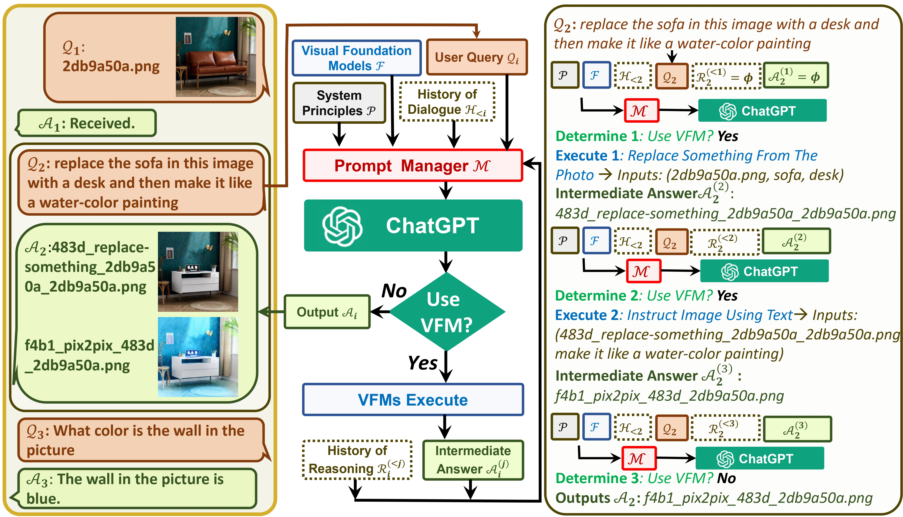

# LLM Study-Notes⏰

   🌐 <a href="https://github.com/FabinGL" target="_blank">Github</a> • ⏬ <a href="https://fabingl.github.io/" target="_blank">HomePage</a>• 📃  

在这个笔记中我会分享一些我个人学习ChatGPT以及LLM大语言模型的过程经历，同时也会记录一些代码上的坑。实际上最近不止玩了LLM还玩了图像的模型，但是现在这个已经很成熟了，所以等以后有空研究研究再写吧。
本人以下操作基于以下电脑配置完成💻。
- CPU:5900X
- GPU:3080Ti O12G
- 内存:32G
- Windows 11
实在穷啊，别人都是拿几张A100玩，我就只能拿自己的个人电脑玩一下了😭。

## Introdation
大语言模型（英文：Large Language Model，缩写LLM），也称大型语言模型，是一种人工智能模型，旨在理解和生成人类语言。它们在大量的文本数据上进行训练，可以执行广泛的任务，包括文本总结、翻译、情感分析等等。LLM的特点是规模庞大，包含数十亿的参数，帮助它们学习语言数据中的复杂模式。这些模型通常基于深度学习架构，如转化器，这有助于它们在各种NLP任务上取得令人印象深刻的表现。

目前我使用的大语言模型分别有以下两种，分别是GPT3.5与国内清华与智谱华章所发行的ChatGLM模型，接下来我会对这两个模型进行系统性的说明与比较。

## GPT3.5
目前对于GPT3.5所配置的API已经可以玩出很多花来了。一般在直接在OPENAI的网站上使用是免费的。如果你要使用接下来的模型就要去OPENAI拿账户的API，我是同学帮我拿的，由于我经常被OPENAI墙😥。**使用OPENAI的API的，LLM模型都是在云端计算的，不需要自身电脑的算力。**

### GPT3.5的配置
这个没有什么困难的，只需要照着OPENAI官网的来就好了，一般就是给个KEY然后GIT一下仓库，jupyter notebook里就可以直接调用了。但是主要就是要钱。效果就可以不用多说了，目前最强的。基本问题他都能解决，这个一般人也都够用了。

#### GPT构建个人网站和小程序API接口
这个点名表扬一下胡同学找到的好东西，找到了这么一个好玩意给我们用。拿出GPT的API以后可以[制作小程序](https://github.com/waylaidwanderer/node-chatgpt-api)以及[构建个人GPT网站](https://github.com/Yidadaa/ChatGPT-Next-Web)。具体教程可以在Google上搜一搜。都是教程。基本就是Fork一下然后稍微配置一下就可以使用了。目前我是配置了我自己的个人ChatGPT的网站，挺好用的。稀土掘金的教程里还说可以配置自己的域名然后就不用挂梯子了。我比较懒就没去配置。但是足够使用了。不配置域名的话也只要挂梯子就可以使用了。这里的梯子的节点就不一定要在美国了，使用官网的GPT服务需要节点挂在美国然后经常被墙，自己的GPT网站不指定挂哪里的梯子，只要挂了梯子都能用，目前还没崩溃过的情况。非要说BUG的话，我之前有一次在别的电脑使用发现他输出在前端网页展示不完整，不过这个应该是前端的问题。目前也就出现过一次，大致是可以忽略的。

可以看到他懂的非常多，由于我最近在进行一些大气学科以及机器学习交叉的工作，所以我也经常问他问题，大气学科的专业名词它也能够答上来，真的很厉害了，强推同学们构建一个自己的网站。

在和ChatGPT聊天之前可以先指定他的运用场景，他可以充当小红书写手，练习雅思的工具等等。非常好用。

### Visual ChatGPT
这个更是个重量级产品，实际上就是GPT4了，在图像领域真的和造神一样。你可以叫他分割图像，也可以叫他生成图，叫他理解图片，不过这个非常吃显存。点这里可以转跳到他的[Guithub项目](https://github.com/microsoft/TaskMatrix)。

可以看到它可以根据你的要求生成图片，提取出线稿等等，最近Diffusion又出来一个模型叫做ControlNet,具体配置可以看[B站的教程](https://www.bilibili.com/video/BV1fa4y1G71W/?spm_id_from=333.999.0.0&vd_source=628628960a416b6de42d5c7fdc17a7fc)（这个模型也很有趣，以后有时间做图像方面的笔记再细聊吧）。Visual ChatGPT在图像方面实现的功能很大程度和ControlNet重叠，不过Visual ChatGPT可以实现图生文的功能。还是那句话：术业有专攻嘛，大家想要真的生成好的图像还是去试试已经完善的扩散生成模型。

Visual ChatGPT配置的话就是分为以下几步:
- Windows电脑需要先下载Git工具，Linux电脑则不用了
- 在你想要安装的地址运行win+R输入CMD打开命令行
- 运行`git clone https://github.com/microsoft/visual-chatgpt.git`，这里要挂梯子。
- 创建新环境，当然这里可以用自己已经有的环境。`conda create -n visgpt python=3.8`
- 激活环境`conda activate visgpt`
- 安装依赖`pip install -r requirements.txt`
- 这里有两个指令分别针对Linux和Windows的，这里的Your_Private_Openai_Key要替换成自己的:
  - windows运行`set OPENAI_API_KEY={Your_Private_Openai_Key}`
  - Linux运行`export OPENAI_API_KEY={Your_Private_Openai_Key}`
- 接着就可以在命令行打开`python visual_chatgpt.py --load "ImageCaptioning_cuda:0,Text2Image_cuda:0"`
这里的模型(Imagecaptioning,Text2Image)是可以组合着来的，也可以指定部署在不同的显卡上(Cuda:n)，其中ChatGPT是利用云端计算返回的结果，所以不占用电脑算力，但是生成图像的过程是在本地电脑上生成的。所以电脑还是需要提供生成图像所要的算力。在我的电脑上启动上述两个模型大概使用了7.5G的显存。**需要注意的是ImageCaptioning这个模块是一定要加载的，不然会报错**(要生成图像首先要了解图像嘛)。**还有一个一定一定要注意的点,所有的图像生成模型下载下来大概在200G上下,大家一定要注意下自己的硬盘容量是否足够！！**

具体算力要求如下:
| Foundation Model        | GPU Memory (MB) |
|------------------------|-----------------|
| ImageEditing           | 3981            |
| InstructPix2Pix        | 2827            |
| Text2Image             | 3385            |
| ImageCaptioning        | 1209            |
| Image2Canny            | 0               |
| CannyText2Image        | 3531            |
| Image2Line             | 0               |
| LineText2Image         | 3529            |
| Image2Hed              | 0               |
| HedText2Image          | 3529            |
| Image2Scribble         | 0               |
| ScribbleText2Image     | 3531            |
| Image2Pose             | 0               |
| PoseText2Image         | 3529            |
| Image2Seg              | 919             |
| SegText2Image          | 3529            |
| Image2Depth            | 0               |
| DepthText2Image        | 3531            |
| Image2Normal           | 0               |
| NormalText2Image       | 3529            |
| VisualQuestionAnswering| 1495            |

所以要运行所有的模型大概需要40G的显存，我玩不起，希望以后可以玩一下吧TAT。

 
上面这张图就是Visual ChatGPT基本的流程结构图，可以看到他就是以ChatGPT作为一个“大脑”来控制其他的“眼睛”（图像模型）的。我上面也提到过，只不过大脑在云端，眼睛是在自己电脑上，所以需要显存运行。

目前我自己也部署好了这个模型，尝试了一下效果，其实效果并不是很好，比如我给他的指令是“画一个亚洲女人”，但是他有时会画出脸崩坏的女人。猫狗的效果都还可以。但是真人图画出来不太好看（相比于专业的扩散模型）。这很明显是本地图像模型生成的问题，不是模型的理解有误（ChatGPT部署在云端，并且我给的关键词很简单）。但实际上我尝试了一下，在专门的扩散生成的模型里输入同样的提示词效果也差不多。所以的话我觉得这是Chatgpt理解后生成的提示词不是很对，在扩散生成模型里面有一个专门的反推提示词的模型叫做`Tagger`，就是我们输入一张图像，他就能生成这个图像的提示词。我觉得未来真要改进的话，这个是一个方向。也就是
**输入->ChatGLM+Tagger耦合->输入扩散生成模型->生成图像->输出**这种结构，我觉得可以实现。（不过我也是个小菜鸡，这只是我的一个拙见）。

目前关于ChatGPT我大概做到的就是这些，后面会继续研究补充一些东西。ps：最近沙特的MiniChatGPT4非常的火，但是我的师兄说效果不行我没有配置，还有一个AutoGPT，那个也是个神一般的模型在我看来，你给一个任务，然后他会有两个GPT打架来互相纠错帮你完成这个任务，这真的很神奇，颇有一种找人给你打工的感觉，但是听说要收费，而且我也看到一些博客里面写到AutoGPT难以收敛（找不到最终的解决办法），我本人电脑算力也不足所以还没尝试，这里记录一下等以后AutoGPT版本稳定了可以做尝试。

## ChatGLM
自从ChatGLM出来以后，清华和智谱AI联手搞了一个模型叫做ChatGLM,ChatGLM目前又有两个版本，一个是[ChatGLM-6b](https://github.com/THUDM/ChatGLM-6B)，一个是[ChatGLM-130b](https://github.com/THUDM/GLM-130B)。ChatGLM-130b不是普通人家能玩起的。显存要求极高。
| **Hardware**    | **GPU Memory** | **Quantization** | **Weight Offload** |
| --------------- | -------------- | ---------------- | ------------------ |
| 8 * A100        | 40 GB          | No               | No                 |
| 8 * V100        | 32 GB          | No               | Yes (BMInf)        |
| 8 * V100        | 32 GB          | INT8             | No                 |
| 8 * RTX 3090    | 24 GB          | INT8             | No                 |
| 4 * RTX 3090    | 24 GB          | INT4             | No                 |
| 8 * RTX 2080 Ti | 11 GB          | INT4             | No                 |

你看看人家这拿来训练的显卡。我暂时就玩不起了，ChatGLM-130b一共有130亿参数，ChatGLM-6b面向普通群众的，参数量是62亿。也可以进行微调，这个后面会详细讲。我目前主要的探索都是基于ChatGLM-6b的模型的。**接下来的所有使用到的模型都是ChatGLM-6b**。

ChatGLM-6b的显存要求如下所示：
| **量化等级**   | **最低 GPU 显存**（推理） | **最低 GPU 显存**（高效参数微调） |
| -------------- | ------------------------- | --------------------------------- |
| FP16（无量化） | 13 GB                     | 14 GB                             |
| INT8           | 8 GB                     | 9 GB                             |
| INT4           | 6 GB                      | 7 GB                              |

